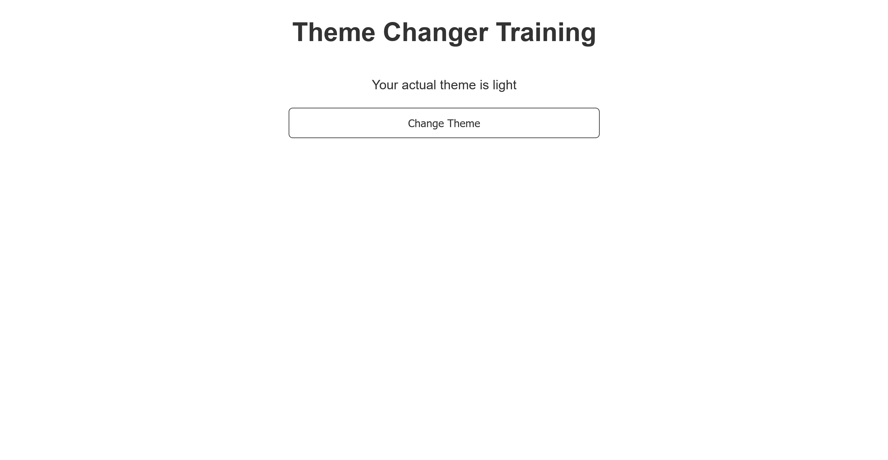

# JS Theme Changer Training

This is just a repository for me to train myself to learn how to change theme

## Table of contents

- [Overview](#overview)
  - [The challenge](#the-challenge)
  - [Screenshot](#screenshot)
  - [Links](#links)
- [My process](#my-process)
  - [Built with](#built-with)
  - [What I learned](#what-i-learned)
  - [Continued development](#continued-development)
  - [Useful resources](#useful-resources)
- [Author](#author)

## Overview

### The challenge

- Finding the algorithm to implement the logic to change the theme
- Experiment with the ".toggle" property from JS
- Using great custom variable name (eg: --color-base-text, --color-base-bg, --color-btn-bg, --border-btn)

### Screenshot



### Links

- Solution URL: [GitHub](https://github.com/Ryusaem/api-pokemon-search-training)
- Live Site URL: [Github Live Demo](https://ryusaem.github.io/api-pokemon-search-training/)

## My process

- Create HTML Structure
- Add an Input and Button "search"
- Style the page to not being ugly
- Fetch data from pokeAPI
- Display the result in a form of Image that was hidden.

### Built with

- Semantic HTML5 markup
- CSS custom properties
- Flexbox
- Mobile-first workflow

### What I learned

What did I learned?

- To recover the value of any input in JS, you target the file and then you use the property "value" on it

```html
<input
  type="text"
  id="pokemonName"
  placeholder="enter pokemon name"
/>
```

```js
const pokemonName = document.getElementById("pokemonName").value;
```

- To communicate with an API (for the method GET which is the default), you can use the traditional fetch() or the modern async fetch(). In this project I train myself with the modern approach which is to me much more simple and clear. We use the keyword "async" first and then we define a function. Inside we define a variable, and we assign it the keyword "await" follow by the function "fetch("URL")". We iniate a second variable named "data" and assign it the keyword "await" follow by the function "x.json()" to convert the data from JSON object to JS object. We have to use the keyword "await" because both "fetch" and "x.json()" are promise (asynchronous)

```js
async function fetchData() {
  try {
    const request = await fetch("URL");
    const data = await response.json();
    console.log(data);
  } catch (error) {
    console.log("Error");
  }
}
```

- I also learn how to add a "src" property to any image or link that didn't had any link. The link in question could have been retrieve by an API call for example (FETCH) and you would use their link to add a "src" to your image

```html

```

```js
const image = document.getElementById("image");
image.src = data.image;
```

- To change the style of an element, you have to target the element in JS, and then access the property "style" follow by your element. Here we add a display to "block" for our "pokemonImage" element

```js
pokemonImage.style.display = "block";
```

### Continued development - Animation in CSS. - Flexbox (the power of using

margin inside any flex item). - Responsivity (Media query understanding). -
Knowing how much a project is going to take as time. - Learning to deconstruct a
website in a Flexbox way to be much more efficient. ### Useful resources -
[PokeAPI](https://pokeapi.co/) - Website of the API for Pokemon. - [How to fetch
data by Bro Code](https://www.youtube.com/watch?v=37vxWr0WgQk) - This help me
understand much more about API and Fetching Data. Great content. ## Author -
Github - [@Ryusaem](https://github.com/Ryusaem) - Linkedin -
[@sambath-meas](https://www.linkedin.com/in/sambath-meas) - Coursera -
[@sambath-meas](https://www.coursera.org/learner/sambath-meas) - Twitter -
[@RyuBraveheart](https://twitter.com/RyuBraveheart) - Frontend Mentor -
[@Ryusaem](https://www.frontendmentor.io/profile/Ryusaem) - CodeWars -
[@Ryusaem](https://www.codewars.com/users/Ryusaem)
